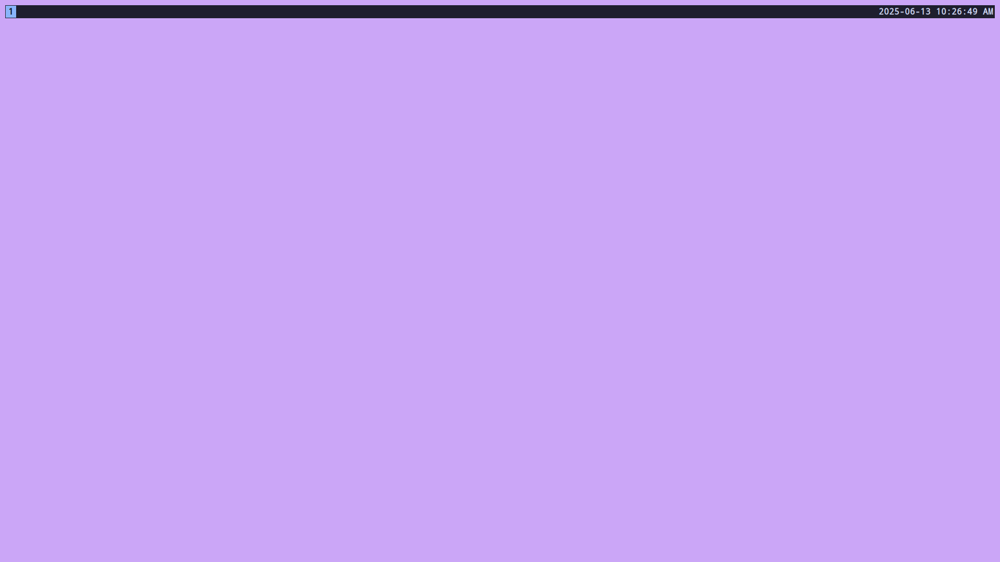
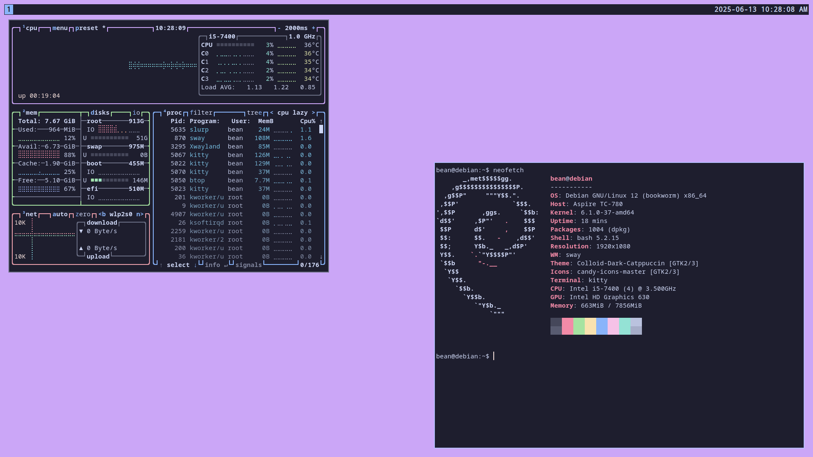

# HydratedBean's swaywm dotfiles


## Installation
```
git clone https://github/com/HydratedBean/dotfiles.git
cd dotfiles
sudo sh ./install.sh
rm -rm ~/.bashrc
stow .
```
Install [Kanata](https://github.com/jtroo/kanata/blob/main/docs/setup-linux.md)\
You might need to set the GTK theme in lxappearance

### Basic Usage
If you installed kanata he `capslock` key has its functionality replaced to be a duplicate `Super` key\
File Explorer: `Super+F1`\
Librewolf Browser: `Super+F2`\
Terminal: `Super+Enter`\
Toggle Fullscreen: `Super+F`\
Switch Workspaces: `Super+Numbers`\
Move windows: `Super+Shift+Arrow Keys or Vim keys`\
Poweroff: `Super+Shift+Delete`